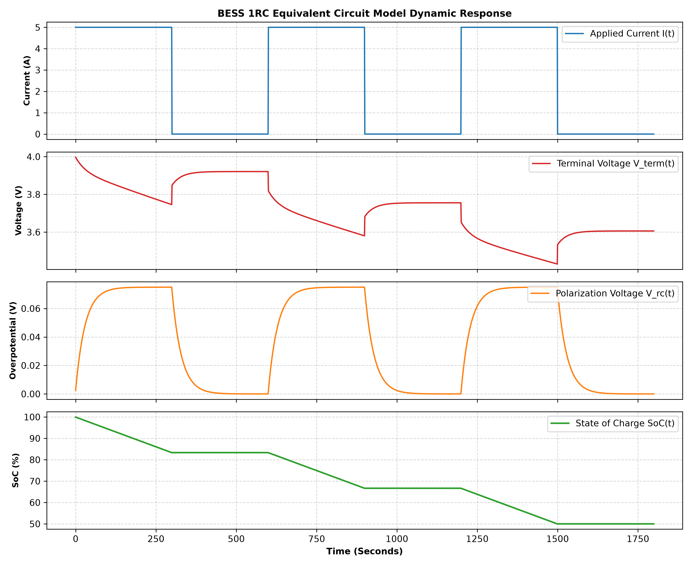

# Battery Energy Storage System (BESS) SoC & Dynamics Solver


Physics-based Python engine implementing a **1RC Thevenin Equivalent Circuit Model (ECM)** for Lithium-Ion cell dynamics, **Coulomb Counting SoC Estimation**, dynamic load profile synthesis, and multi-panel transient analytics.

## Mathematical Governing Equations

### 1. Terminal Voltage Dynamic Equation
$$V_{term}(t) = V_{ocv}(SoC) - I(t) \cdot R_0 - V_{rc}(t)$$

### 2. RC Polarization Differential Dynamics
$$\frac{dV_{rc}}{dt} = \frac{I(t)}{C_1} - \frac{V_{rc}(t)}{R_1 C_1}$$

### 3. Coulomb Counting State-of-Charge (SoC)
$$SoC(t) = SoC(0) - \frac{\int_0^t I(\tau) d\tau}{Q_{nominal}}$$

## Simulation Artifacts

### Pulsed Discharge Dynamic Response


## How to Run
```bash
source bess_env/bin/activate
PYTHONPATH=. pytest tests/
python3 main.py
